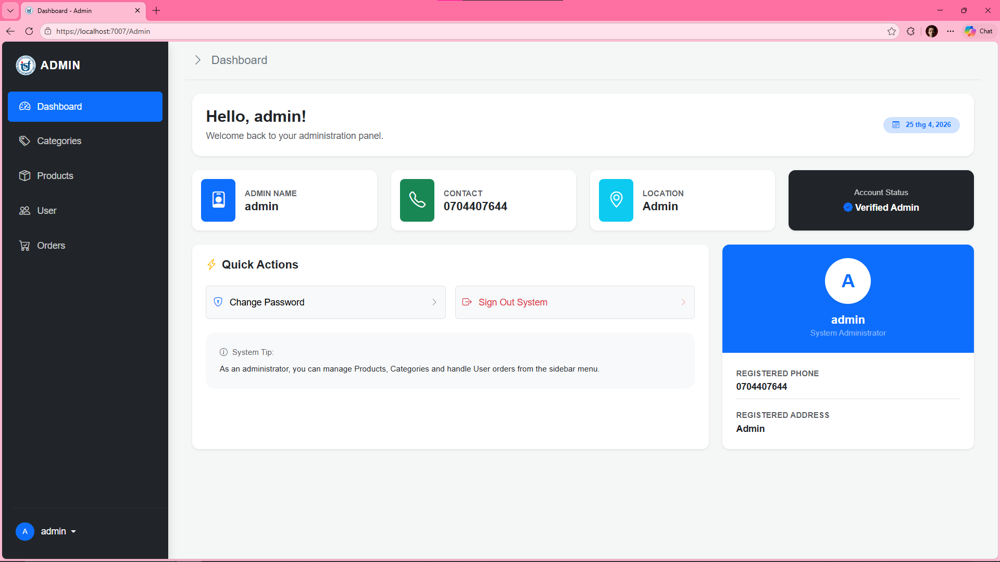
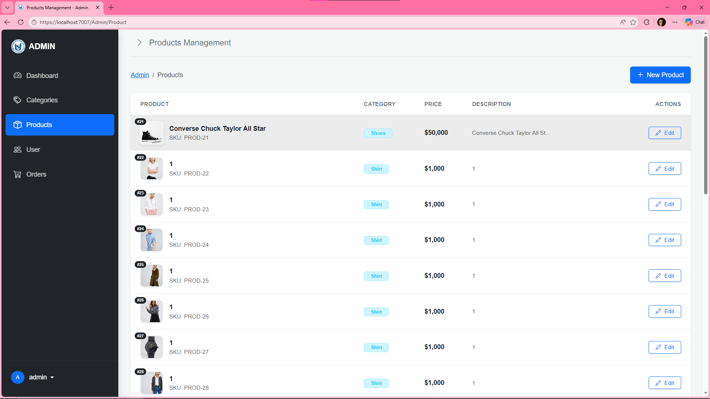
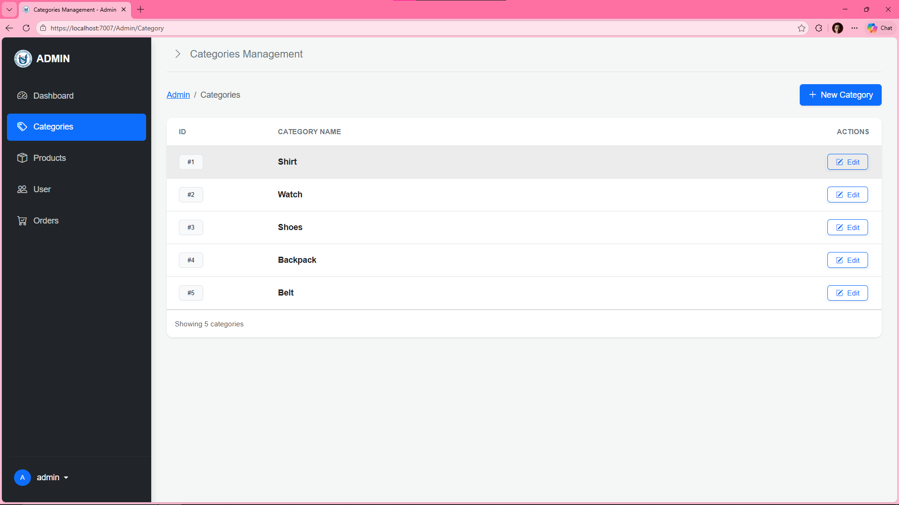
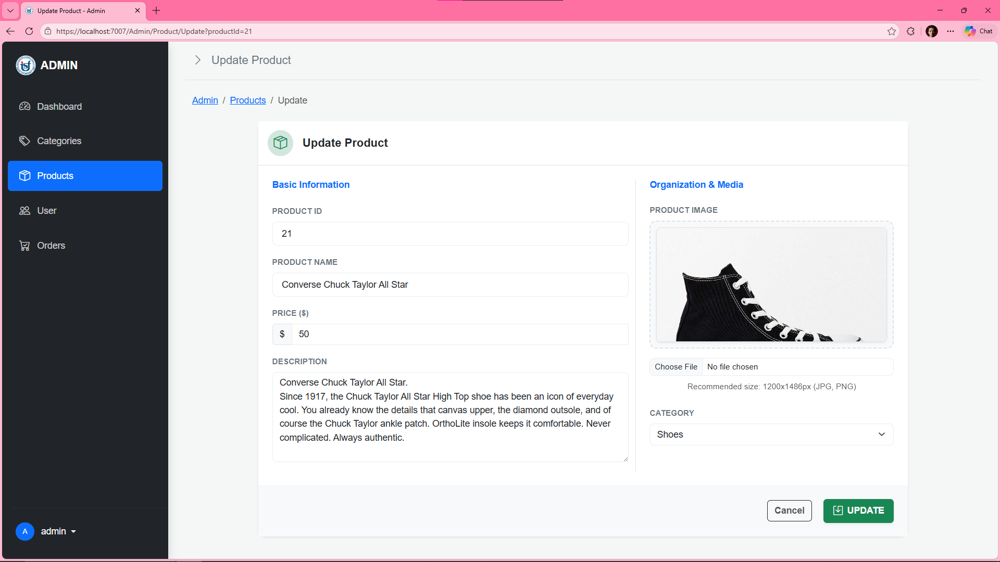
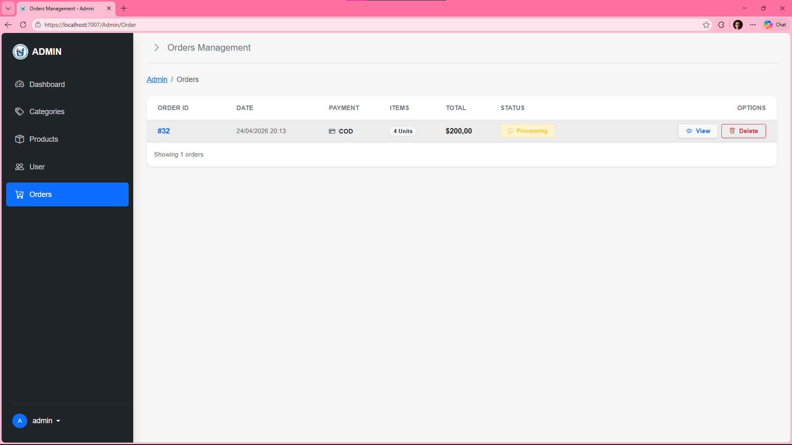
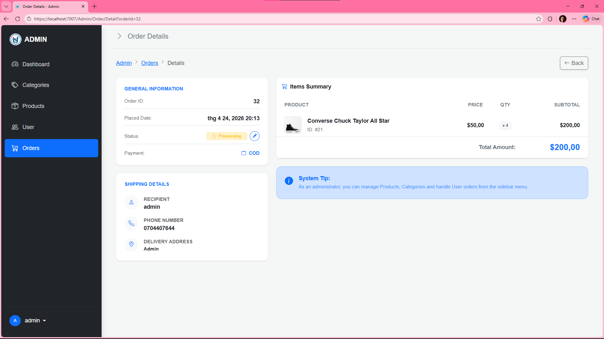
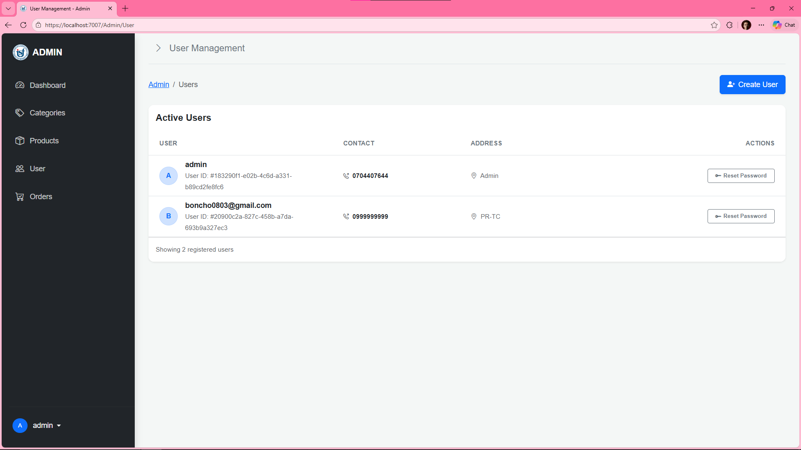
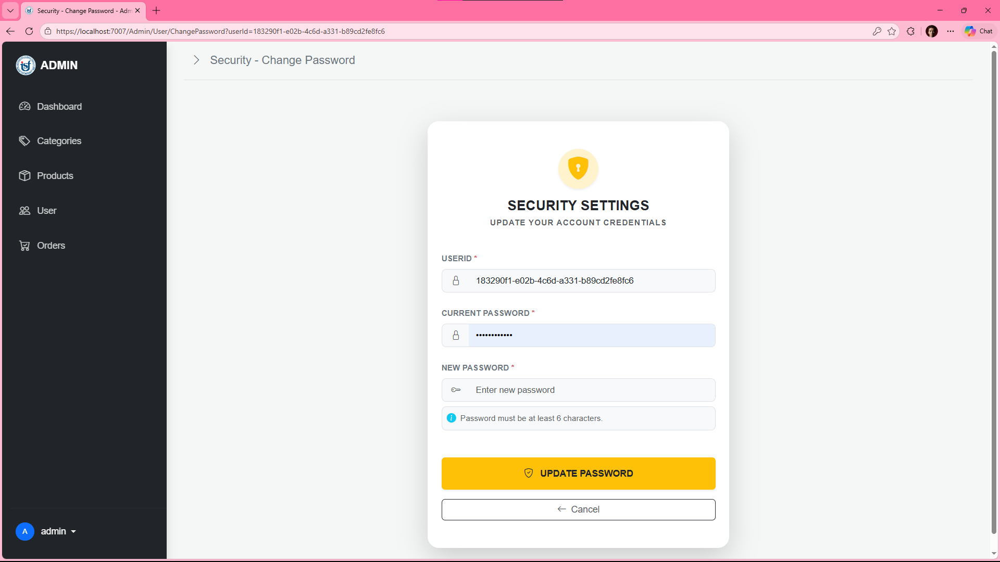

# 🛒 **E-Commerce - Online Shopping Platform**

**Online Shopping Platform** provides a workflow for Users—from secure authentication and product discovery to a simplified checkout and real-time order tracking.

Furthermore, it features a Admin Dashboard, providing administrators with control products, categories, orders, and user management through a secure, role-based access control (RBAC) system.

## 🌐 Deployment
- 🚀 **Web App**: [phamquoctuan041203.runasp.net](http://phamquoctuan041203.runasp.net/)
- 📖 **API Swagger**: [phamquoctuan041203.runasp.net/swagger](http://phamquoctuan041203.runasp.net/swagger/index.html)


## 🛠️ Tech Stack
- ⚙️ **Backend**: C# (ASP.NET Core 8)
- 🔗 **ORM**: Entity Framework Core 8
- 🗄️ **Database**: SQL Server 2022
- 🔐 **Authentication**: ASP.NET Identity + JWT Bearer
- 📄 **API Documentation**: Swagger / Swashbuckle
- 🎨 **Frontend**: Razor Views, Bootstrap, JavaScript
- 🌈 **Icons**: Bootstrap Icons, Font Awesome


## ✨ Features

### 👤 Customer
- **Auth & Profile:** Secure authentication and account management.
- **Shopping:** Smart product filtering (categories, price, keywords) and dynamic cart.
- **Checkout:** Streamlined order placement and address management.
- **Tracking:** Real-time order history and status monitoring.

### 👨‍💼 Admin Panel
- **Authorization:** Secure RBAC (Role-Based Access Control).
- **Catalog:** CRUD for Products and Categories.
- **Sales:** Order processing, shipping updates, and status management.
- **Users:** Account oversight and security credential resets.

### 🖥️ Admin Interface
<details>
<summary><b>🔍 Click to see Admin Screenshots</b></summary>

| Dashboard | Products Management |
|:---:|:---:|
|  |  |
| **Category Management** | **Product Update** |
|  |  |
| **Order Management** | **Order Details View** |
|  |  |
| **User Management** | **Security & Password** |
|  |  |

</details>

## API Endpoints

### Auth API (`/api/AuthApi`) - ``Bearer token``
- `POST /login` - Login (get JWT token)
- `POST /register` - Register (get JWT token)
- `POST /logout` - Logout
- `GET /profile` - Get user profile
- `PUT /profile` - Update profile
- `POST /change-password` - Change password
- `GET /verify-token` - Verify token
- `GET /user-info` - Get basic current user info

### Product API (`/api/ProductApi`)
- `GET /` - List Products (`categoryId`, `search`, `minPrice`, `maxPrice`, `sortPrice`)
- `GET /{productId}` - Get Product detail

### Category API (`/api/CategoryApi`)
- `GET /` - List Categories
- `GET /{categoryId}` - Get Category detail

### Order API (`/api/OrderApi`)
- `GET /payment-methods` - Get Payment methods
- `POST /direct-checkout` - Create Order from item list ``Bearer token``
- `GET /my-orders` - Get current User Orders ``Bearer token``
- `GET /{orderId}` - Get current User Order detail ``Bearer token``

## 🏗️ Solution Structure
```text
E-Commerce/
├── E-Commerce/
│   ├── ApiControllers/          # REST API endpoints
│   ├── Controllers/             # MVC controllers
│   ├── Areas/Admin/             # Admin area
│   ├── Models/                  # Entities, DTOs, ViewModels, DbContext
│   ├── Services/                # Business/service layer
│   ├── Helpers/                 # Utility classes
│   ├── wwwroot/                 # Static files
│   ├── Program.cs               # ⚙️ Project settings & configurations
│   └── appsettings.Example.json
└── README.md
```

## 🚀 Setup & Run Locally

### 1) 📥 Clone
```bash
git clone https://github.com/quoctuan-IT/E-Commerce.git
cd E-Commerce
```

### 2) ⚙️ Configure App Settings
- Open **SQL Server** create your database to set up `ConnectionStrings`
- ✏️ Rename `E-Commerce/appsettings.Example.json` to `E-Commerce/appsettings.Development.json`
- Update the fields:
  - `ConnectionStrings:DefaultConnection`
  - `Jwt:Key`
  - `Jwt:Issuer`
  - `Jwt:Audience`

### 3) 🔄 Migrate Database
- Open `Nuget Package Manager Console`
```bash
Add-Migration Init
Update-Database
```

### 4) 🐞 Debug and Run

### 5) 🌍 Access
- MVC: `https://localhost:<port>/`
- ADMIN: `https://localhost:<port>/admin`
- API: `https://localhost:<port>/swagger`

## 🧪 Quick API Test Flow `(Swagger)`
1. Open `/swagger`.
2. 🔑 Call `POST /api/AuthApi/login` (or `register`) to get `accessToken`.
3. 🔓 Click **Authorize** and input `Bearer <accessToken>`.
4. ✅ Test protected endpoints:
   - `GET /api/AuthApi/profile`
   - `POST /api/OrderApi/direct-checkout`
   
```json
{
  "paymentMethodId": 1,
  "address": "99 Address",
  "phoneNumber": "0123456789",
  "items": [
    { "productId": 1, "quantity": 1 },
    { "productId": 2, "quantity": 2 }
  ]
}
```
   - `GET /api/OrderApi/my-orders`

## 📝 Notes
- Product images root: wwwroot/images/models.
- Uploaded images are saved at: wwwroot/uploads/products (ignored by git).
- Swagger is fully configured to support JWT Bearer authentication.

<div align="center">
    <br />
    <svg width="100%" height="10" xmlns="http://www.w3.org/2000/svg">
        <defs>
            <linearGradient id="grad1" x1="0%" y1="0%" x2="100%" y2="0%">
                <stop offset="0%" style="stop-color:#0d6efd;stop-opacity:1" />
                <stop offset="100%" style="stop-color:#ff69b4;stop-opacity:1" />
            </linearGradient>
        </defs>
        <rect width="100%" height="4" fill="url(#grad1)" rx="2" />
    </svg>
    <br />
    <p align="center">
        
        
        
        
    </p>
    <p>
        💻 Developed by <strong style="color: #ff69b4;">Phạm Quốc Tuấn</strong> ❤️<br/>
        🎓 <strong>IT - Saigon University (SGU)</strong>
    </p>
    <p>
        <a href="https://github.com/quoctuan-IT">
            
        </a>
    </p>
    <p style="color: #888; font-size: 0.85rem;">
        &copy; 2026 Online Shopping Project. All rights reserved.
    </p>
</div>